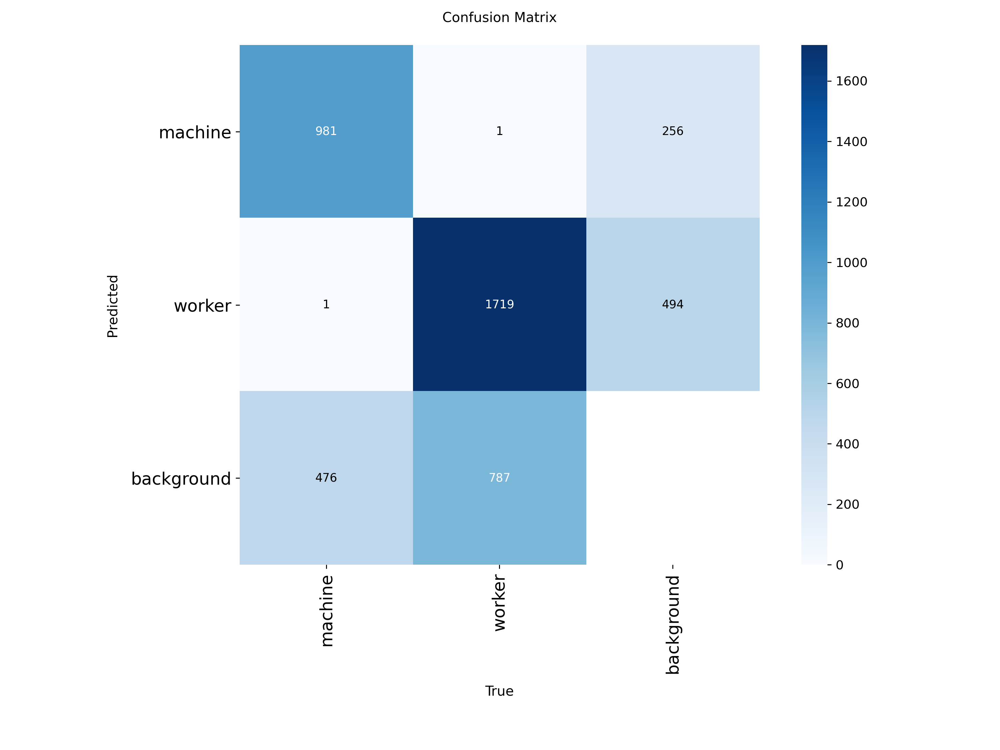
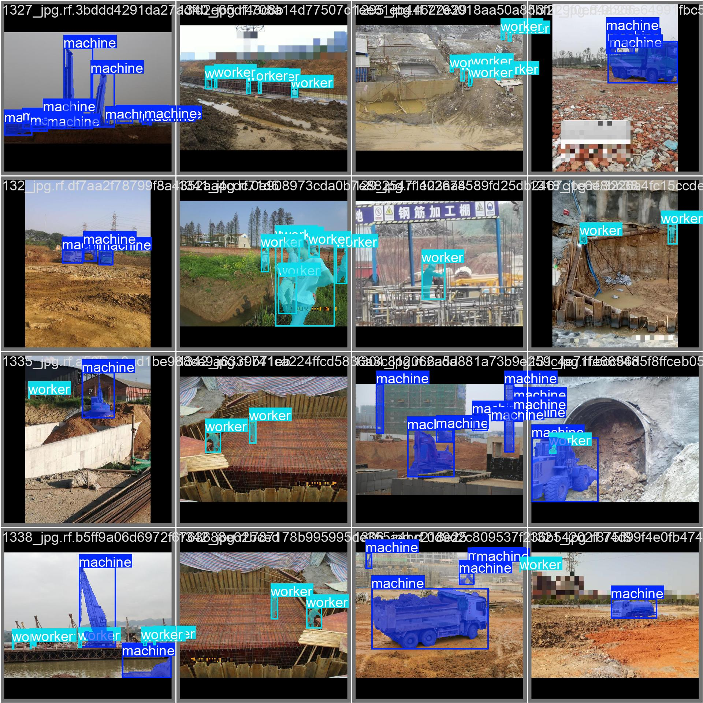
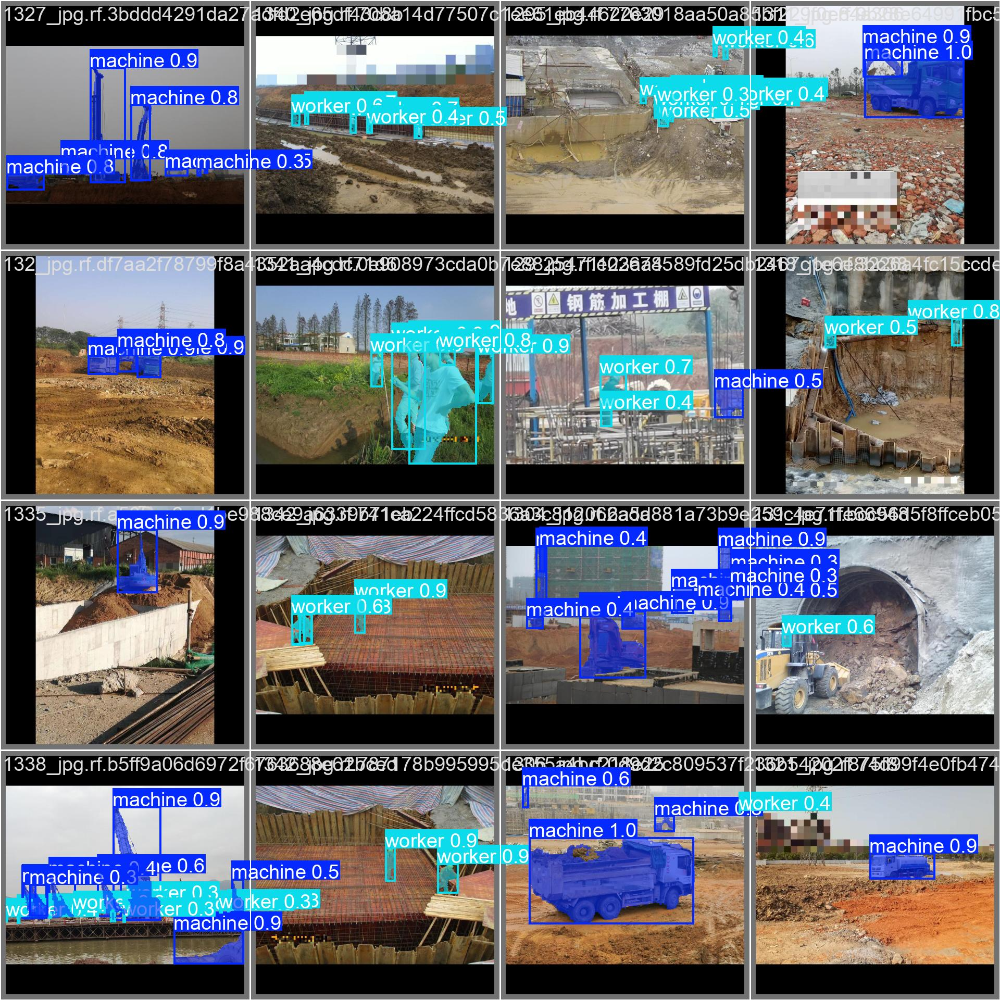

# Object_segmentation
Training an object segmentation model (YOLO11-seg) to segment workers and machinery on working sites

## Introduction

Image segmentation is a fundamental task in computer vision that involves partitioning an image into meaningful regions or segments. These segments correspond to objects, parts of objects, or regions of interest within the scene, enabling more detailed analysis than simple object detection or classification.

Segmentation can be broadly categorized into three types:

- **Semantic Segmentation**: Assigns a class label to every pixel in an image, grouping all pixels of the same category together without distinguishing between different object instances. For example, all workers in an image would be labeled as "worker" without differentiating individual persons.

- **Instance Segmentation**: Not only classifies each pixel but also differentiates between distinct objects of the same class. This means each worker or piece of machinery is individually identified, allowing for object-specific analysis and tracking.

- **Panoptic Segmentation**: Combines the strengths of semantic and instance segmentation by labeling all pixels with both semantic class information and instance identities, covering both "stuff" (amorphous regions like sky or road) and "things" (countable objects like people and machines).

In the context of our worker environment, **instance segmentation** is particularly valuable. Tracking individual workers and machinery allows us to monitor safety compliance effectively—such as verifying if each worker is wearing a hardhat. Assigning unique IDs to workers enables precise tracking and helps reduce redundant alerts—for example, issuing a single alert when a specific worker is found without protective equipment, rather than multiple alerts triggered by the same person across frames. This targeted approach improves both safety management and operational efficiency.

The objective of this project is to train a model to perform instance segmentation on workers and machinery within our worksite environment. The goal is to evaluate segmentation performance and compare it with previous results obtained from object detection tasks. Unlike detection, segmentation provides pixel-level masks for each instance, which is crucial for more precise monitoring and compliance verification.

For this task, we use **YOLOv11-seg**, a recent model from the YOLOv11 family specifically designed for segmentation. YOLOv11-seg combines the real-time speed of YOLO architectures with the capability of generating accurate instance masks. By leveraging this model, we aim to achieve efficient and robust segmentation of workers and equipment to support advanced safety analysis.

## Setup

### Dataset and Preprocessing

The dataset used for training and evaluation was sourced from [Roboflow's "HQ + hole detection, moving objects Computer Vision Project"](https://universe.roboflow.com/thesis-2zk7q/hq-hole-detection-moving-objects). It contains a total of **5,576 images** capturing workers and machinery in various industrial scenarios.

All images were resized to **640 × 640 pixels**, using a _black edge fit_ strategy to preserve aspect ratio and avoid distortion.

To improve model robustness, **data augmentation** was applied:
- Each original image was augmented into two training samples.
- **Horizontal flipping** was used because it does not compromise or distort the segmentation masks, while helping the model generalize better to variations in object orientation.

The dataset was split into three subsets:
- **Training**: 3,903 images  
- **Validation**: 836 images  
- **Testing**: 837 images  

This split follows a 70% / 15% / 15% distribution and ensures balanced representation across all stages of model development and evaluation.

### Evaluation Metrics

To evaluate the performance of our object segmentation model, we rely on standard metrics commonly used in segmentation tasks: **Precision**, **Recall**, and **mean Average Precision** (mAP).

- **Precision** measures the proportion of true positive predictions among all positive predictions made by the model, indicating how accurate the model's positive predictions are. Since we are segmenting two classes—**workers** and **machinery**—we report precision separately for each class to understand class-specific performance.

- **Recall** measures the proportion of true positive predictions among all actual objects, reflecting the model's ability to find all relevant instances in the dataset.

The primary metric for instance segmentation is the **mean Average Precision (mAP)**, which summarizes the trade-off between precision and recall across different Intersection over Union (IoU) thresholds.

In our evaluation, we report:

- **mAP@0.5**: The average precision when predicted masks are considered correct if their IoU with ground truth masks is at least 0.5.
- **mAP@0.5:0.95**: The average mAP computed at multiple IoU thresholds from 0.5 to 0.95 with a step size of 0.05, providing a more comprehensive and stringent measure of segmentation quality.

Reporting precision per class alongside overall mAP helps us analyze how well the model distinguishes and segments workers and machinery individually, enabling targeted improvements in the segmentation pipeline.

## Hyperparameter Optimization and Model Training

To optimize the performance of the YOLOv11-seg model on our segmentation task, we conducted a **random search** over the following hyperparameter space:

- **Batch size**: tested values of 16 and 32.
- **Initial learning rate (`lr0`)**: tested values of `1e-3` and `1e-4`.
- **Weight decay**: tested values of `1e-4` and `1e-3`.
- **Optimizer**: tested both **SGD** and **Adam** optimizers.

A total of 6 trials were performed, each with a unique combination of these hyperparameters.

Each trial trained the YOLOv11-seg model for 10 epochs. Training and validation metrics, including loss and mean Average Precision (mAP), were logged and monitored using **Weights & Biases (wandb)**. This logging enabled systematic comparison of results across trials and facilitated selection of the best hyperparameter configuration.

The random search approach provided an efficient way to explore different hyperparameter combinations, ultimately improving the segmentation accuracy for workers and machinery in our environment.

*Figure 1 : Loss and metric curves for the different hyperparameter configurations tested during the random search optimization of the YOLOv11-seg model.*

The hyperparameter configuration consisting of a batch size of 32, a learning rate of 0.0001, a weight decay of 0.0001, and the Adam optimizer yielded the best overall segmentation performance. This setup consistently achieved the highest or near-highest results in both `metrics/mAP50 (M)` and `metrics/mAP50-95 (M)`, indicating strong mask quality across a range of IoU thresholds. In addition to its superior performance on these metrics, the corresponding training and validation loss curves exhibit coherent and stable behavior. The segmentation loss (`val/seg_loss`) decreases progressively and smoothly over the course of training. Importantly, the training and validation loss curves follow similar trends, which suggests a consistent learning process and a low risk of overfitting. Other loss components, such as `val/cls_loss`, `val/dfl_loss`, also remain low and stable throughout training. While the precision achieved by this configuration is among the highest across all runs, the recall is comparatively lower, although still within the top-performing configurations. This indicates that the model is accurate when it makes predictions but may miss a portion of the relevant instances.

Based on the results of the random search hyperparameter tuning, the final YOLOv11n-seg model was trained using the most effective configuration identified: a batch size of 32, a learning rate of 0.0001, a weight decay of 0.0001, and the Adam optimizer. This configuration was selected due to its consistently strong performance across mask-based evaluation metrics (`mAP50 (M)` and `mAP50-95 (M)`) and stable loss behavior. The model was trained for 100 epochs, in order to fully explore the optimization trajectory and allow the loss to continue decreasing over a longer time scale. This extended training period provided the model with sufficient capacity to refine its segmentation masks and minimize generalization error, while enabling thorough observation of training and validation dynamics.

## Results

The final YOLOv11n-seg model, trained with the best-performing hyperparameter configuration, was evaluated on the held-out test split to assess its generalization performance. The results reported below focus on mask-based evaluation metrics, which are most relevant for the instance segmentation task.

  
| Metric                  | Value   |
|-------------------------|---------|
| Precision (M)           | 0.865   |
| Recall (M)              | 0.609   |
| mAP@0.5 (M)             | 0.690   |
| mAP@0.5:0.95 (M)        | 0.418   |

*Table 1 : Metrics on the test set*

These values indicate that the model achieves high segmentation precision, successfully avoiding most false positives. Recall is moderately lower, suggesting that while most predicted masks are correct, some true instances may go undetected. The mAP@0.5 metric of 0.690 demonstrates that the model reliably localizes and segments objects with a reasonable degree of overlap. Meanwhile, the mAP@0.5:0.95 score of 0.418, while lower—as is typical with this stricter metric—still reflects satisfactory performance across a range of IoU thresholds. This suggests that the model maintains relatively consistent segmentation quality across both coarse and fine-grained evaluation conditions, even if some precision is lost at higher IoU requirements.

To complement the quantitative results, a normalized confusion matrix is presented to analyze class-wise performance and misclassifications. Additionally, qualitative visualizations of the model's segmentation outputs on the test set are included to illustrate its ability to correctly segment workers and machinery in varied scenes. These examples further confirm the model's robustness and effectiveness in real-world conditions.

 

  
   
  <em>Figure 2: Confusion matrix for test set</em>

 

While a large number of workers and machines are successfully detected, a portion of them remains undetected or is occasionally misdetected.

  
  
   
  <em>Figure 3 : Segmentation output labels (left) and predictions (right) by the model</em>

### Discussion and Comparison with Object Detection Results

The previous object detection model achieved notably higher performance metrics, with a precision of 99.1%, recall of 98.2%, mAP@0.5 of 99.4%, and mAP@0.5:0.95 of 89.4% on the test set. In contrast, the current segmentation model obtained lower scores, particularly in mAP metrics, reflecting the increased complexity of the segmentation task.

It is important to consider that the object detection model was trained to detect only a single class, *workers*, whereas the segmentation model handles two classes: *workers* and *machinery*. This multi-class setup inherently introduces additional challenges, as the model must accurately distinguish and segment multiple types of objects within the scene. Furthermore, instance segmentation demands pixel-level precision in delineating object boundaries, which is a more complex and fine-grained task than bounding box detection. Therefore, lower metrics in segmentation compared to detection are expected and consistent with the increased difficulty of the task.

Moreover, while the quantitative evaluation on the dataset provides valuable insights, it remains essential to validate the model's performance on real worksite footage where the hardware and software system will be deployed. Real-world conditions may introduce additional variability in lighting, occlusions, and object appearances, which could affect detection and segmentation accuracy. Such field testing will be critical to fully assess the practical effectiveness and robustness of the segmentation model in operational settings.

### Conclusion

This project demonstrated the development and evaluation of an instance segmentation model based on YOLOv11-seg for detecting and segmenting workers and machinery in industrial environments. The final model, trained with a carefully selected set of hyperparameters, showed strong performance in mask precision and mAP@0.5, indicating its potential for real-world deployment in safety monitoring and spatial analysis applications.

However, several limitations remain. While many objects are correctly segmented, some workers and machines are still missed or incorrectly segmented, particularly in crowded or low-visibility scenes. The model’s performance on the more stringent mAP@0.5:0.95 metric also highlights room for improvement in fine-grained mask quality and localization precision. Compared to a previously trained object detection model, the segmentation model underperformed in all metrics, which is expected given the increased complexity of the task and the multi-class setting.

Future work could explore improvements such as longer training schedules, more diverse augmentation strategies, incorporation of temporal information from video sequences, or the use of more advanced segmentation architectures. Additionally, testing the model on real worksite footage under deployment conditions is essential to assess its true robustness and to guide further refinement for operational use.

  

